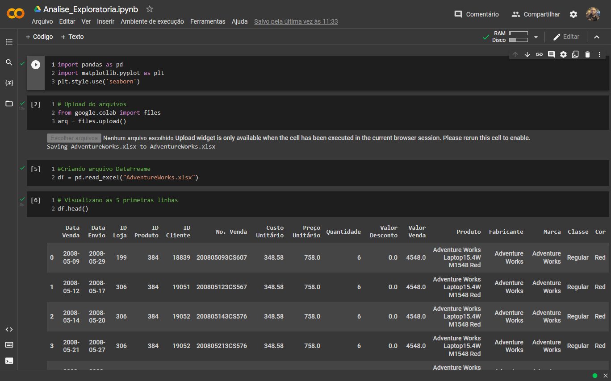

<h1 align="center">
    
</h1>

## 📑 Sobre
Projeto desenvolvido para conhecer os principios básico da bliblioteca Pandas junto a liguagem Python.

**Projeto** 
Analise de dados com Pandas e Python
⏱ 4h
* [Google Colab Notbooks](https://colab.research.google.com/drive/1qL0PCtvaoFI-MjTq7TqfX0WyVhevP_UG?usp=sharing)

## 💻 Layout
