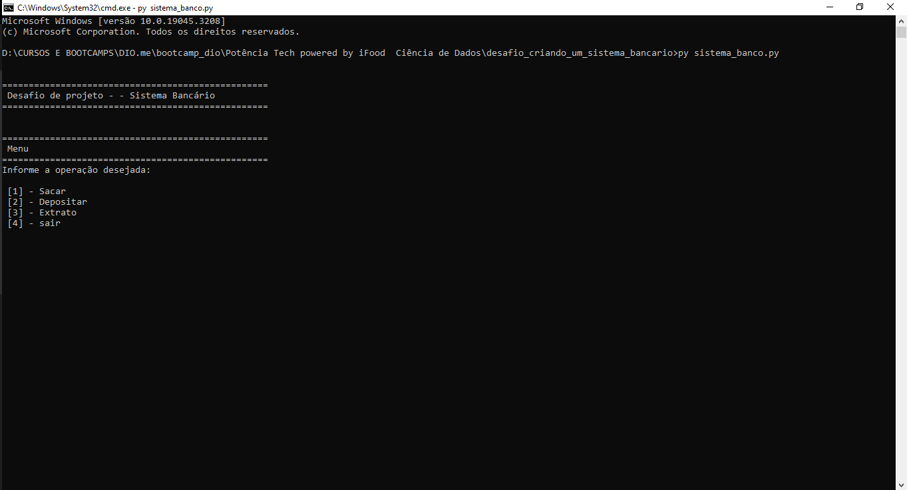
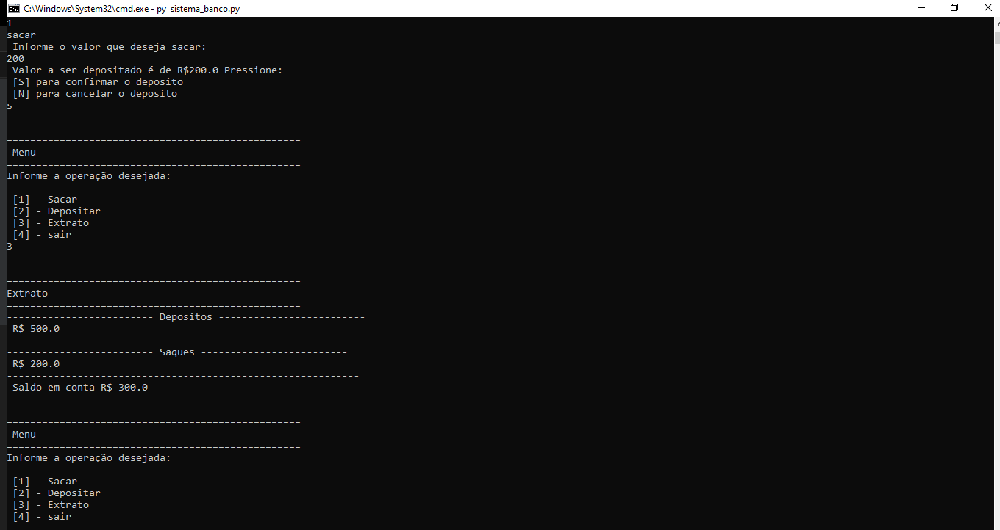

<h1 align="center">
    
</h1>

# 📑 Sobre
Projeto bootcamp iFood junto a Digital Innovation One com objetivo de aplicar os conhecimentos adquiridos no módulo de desenvolvimento em python.
O projeto desenvolvido simula ações basicas de um sitema bancário como por exemplo, Sacar, Depositar e visualizar extrato..

**Modulo:** Dominando python para cência de dados
 

# 🚀 Tecnologias

      
    

 

# 🖱 Layout

* 

* 

* 

